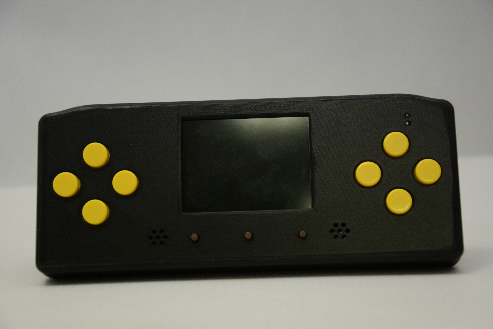
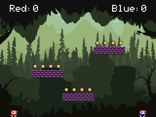
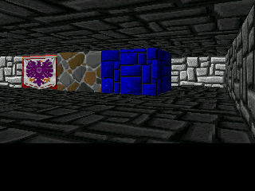

# AirBoy

[Dokumentacja i schematy](https://github.com/kuba8888/documentation-AirBoy/blob/main/dokumentacja.pdf)

## Tematyka

 - Temat projektu: konsola przenośna do gier
 - Cel projektu: nauka o tworzeniu wysocezintegrowanych systemów

<!--## Budżet-->

<!--| Nazwa | Cena jednostkowa | Ilość | Cena |-->
<!--| ----- | ---------------- | ----- | ---- |-->
<!--| ESP32 | 30 zł | 2 | 60 zł | -->
<!--| Ekran TFT | 70 zł | 2 | 140 zł |-->
<!--| TP4056 | 7 zł | 2 | 14 zł |-->
<!--| Przetwornica | 5 zł | 2 | 10 zł |-->
<!--| Ogniwa LiPo | 30 zł | 2 | 60 zł |-->
<!--| Max 98357A | 5 zł | 2 | 10 zł |-->
<!--| Złącze pinowe | 2 zł | 2 | 4 zł |-->
<!--| PCB | 10 zł | 2 | 20 zł |-->
<!--| | | Suma | 318 zł |-->

## Hardware

 - Ekran 2.8" lub większy (duży i czytelny)
 - Medium: karta sd lub flash cartridge
 - Mikrokontroler: ESP32 (240 mhz, wireless, DMA)
 - Chip dźwięku: MAX 98357A (dekoder i2s) lub wbudowany w ESP DAC
 - Sterowanie: krzyżak, 4 przyciski, bumpery, start i select

## Software

 - Biblioteka: 
	 - sprite'y (kolizja, wykrywanie zdarzeń)
	 - IO
	 - przewijanie ekranu
	 - tilemapy
	 - timery
	 - dźwięk
 - Gry: 
	 - pong (sieciowy)
	 - snake (sieciowy)
	 - tic tac toe (sieciowe)
	 - pacman
	 - asteroids
	 - tetris (hitreg popsuty)
	 - arcanoid

## Terminarz

Time is relative

## Zespół

 - Lider Zespołu - Jakub Mierzyński:
	- Organizacja pracy
	- Nadzór nad postępami
	- Przygotowywanie sprawozdań na koniec okresów rozliczeniowych
	- Opracowowywanie ulepszenia systemu i sprzętu
	- Tworzenie gier na sprzęt
 - Technik Informatyk - Piotr Mijakowski:
	- Projektowanie i montaż rozwiązań sprzętowych
	- Tworzenie i realizacja zamówień
	- Rewizja sprzętowych funkcjonalności kodu
	- Tworzenie gier na sprzęt
	- Tworzenie testów integracyjnych
 - Technik Programista - Piotr Zieniewicz:
	- Tworzenie biblioteki sprzętowej
	- Testowanie nowych funkcjonalności
	- Tworzenie gier na sprzęt

